### 
 Data Scientist with a strong business background and provide data-driven decision making
Especially passionate about experimentation, solving problems by applying ML models, finding actionable insights from data, and efficient visualization. I have worked as a data scientist and analyst for more than 4 years, mainly in e-commerce companies. 

 

### Visualization samples

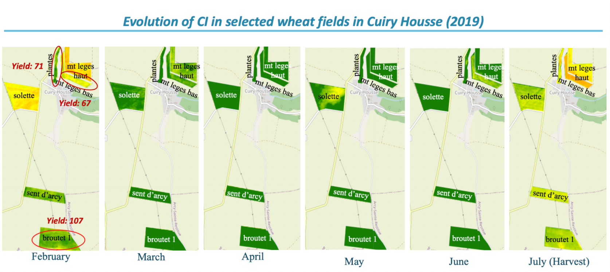
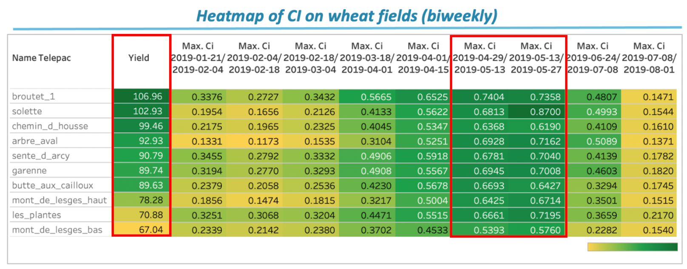

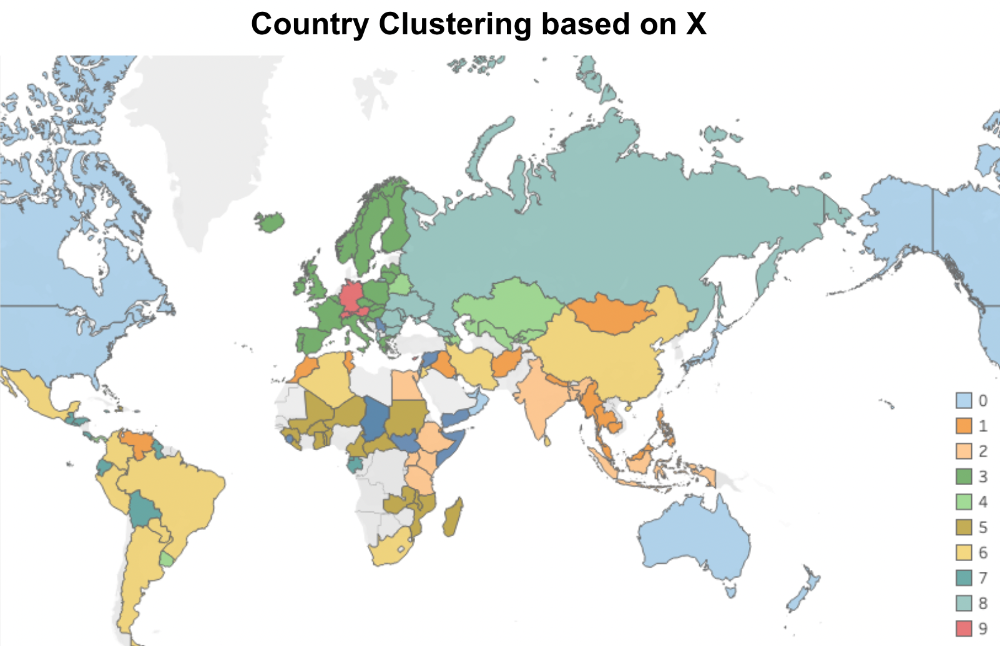

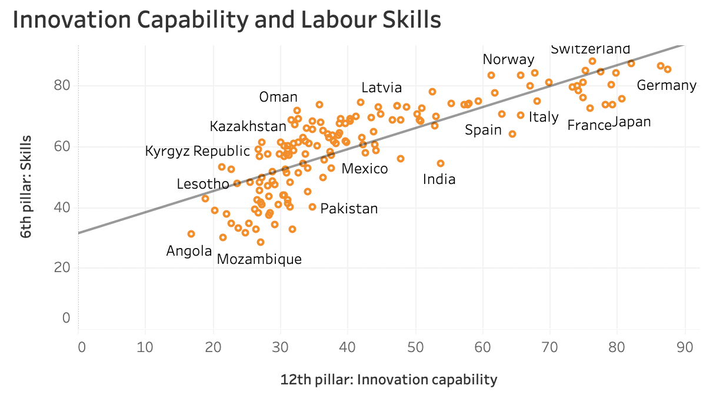
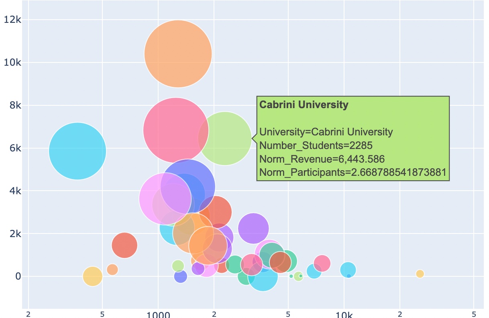

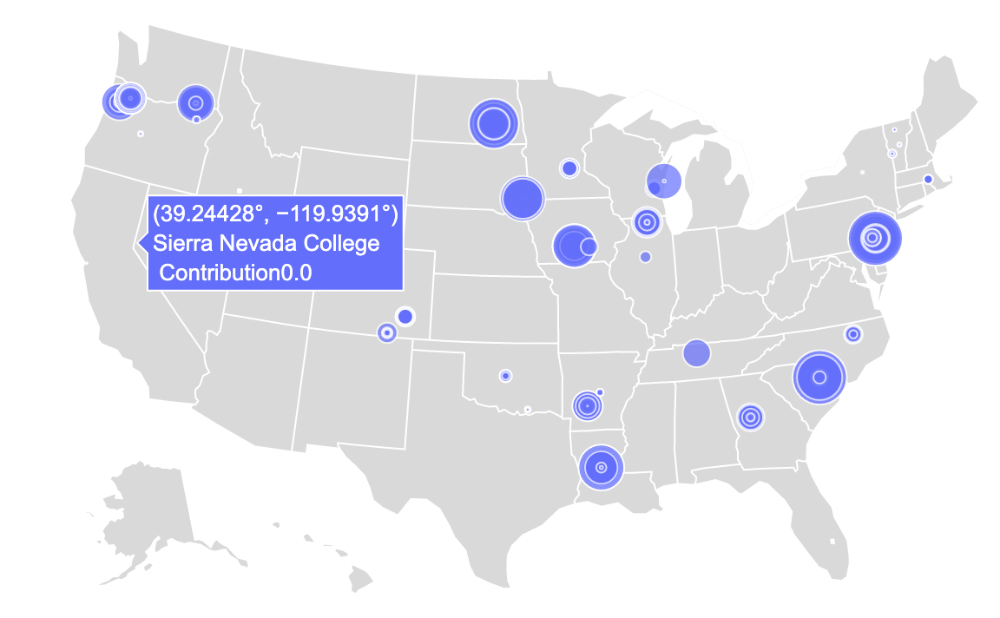
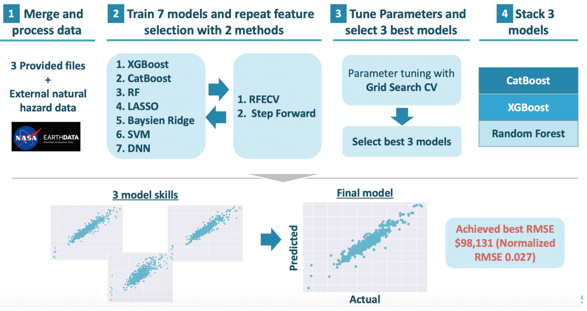

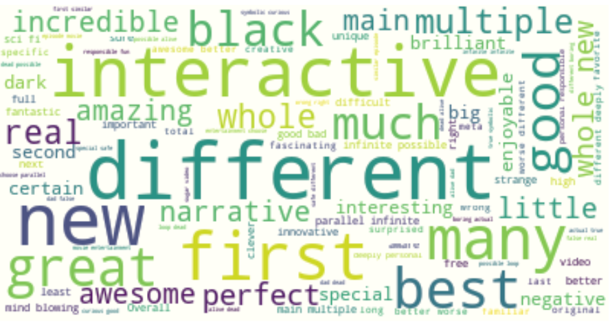
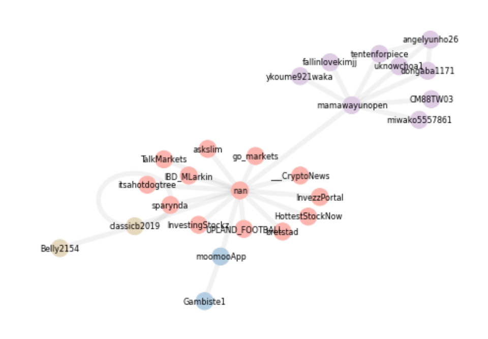

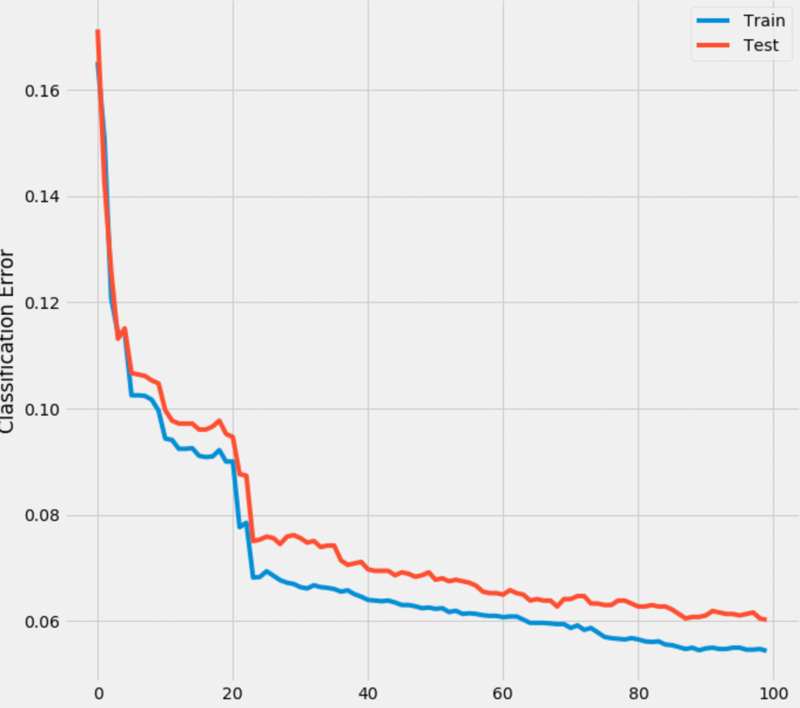

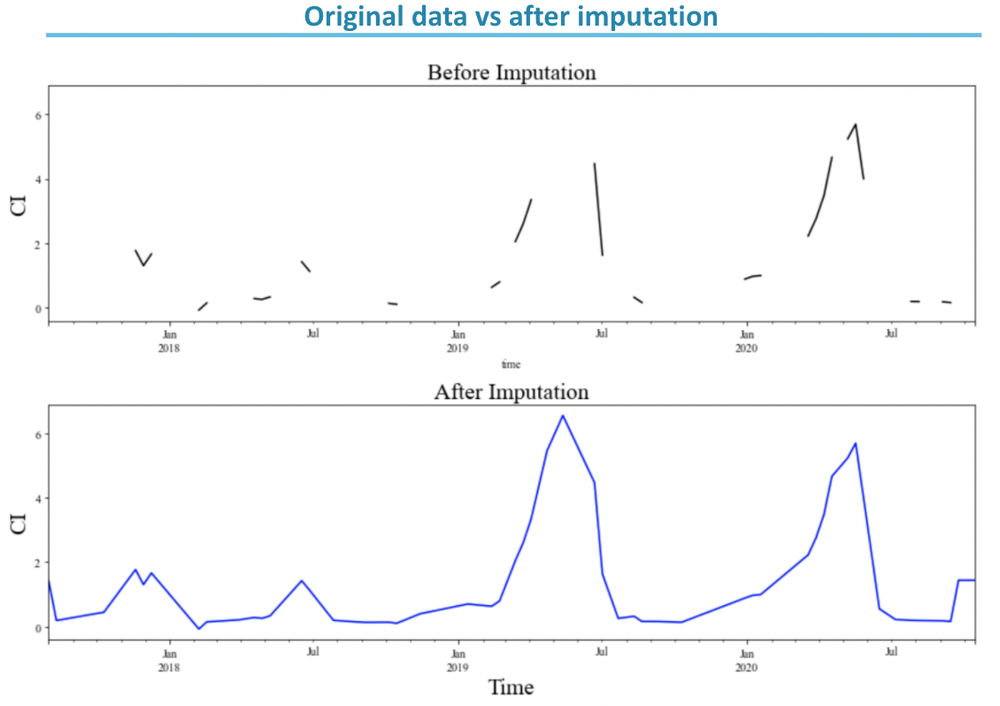
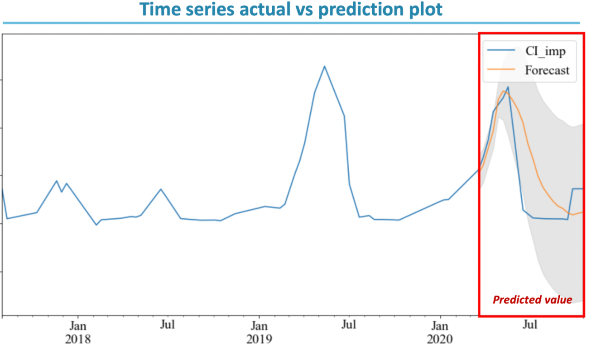

 

#### Career story
- **Emerton: Data Scientist & Strategy Consltant**📈💼  
One of the most well known data science team in Paris, first time to create my own python packages for clients, build pipeline on a server, deal with satellite image, remote sensing, and implement state-of-art techniques. Many strategic and due diligence projects for one of the largest companies in the world. However, I am currently thinking to go back to a pure data scientist.   
- **Rakuten: Data Scientist**📈  
Tokyo to Paris to do more experimentations and find insights !   
- **Farfetch: Data Analyst / Scientist**📈  
Previous manager at Gucci invided me to join his team, so I did ! Experimentations on marketing channels and websites. Promoted after a year   
- **EY: Consultant**💼  
Gained logical thinking process and professionalism to work for company executives, promoted within a year   
- **Gucci: e-commerce Data Analyst intern**📈  
Very first moment to find my passion in data wangling and insight analysis   
- **Google: summer business intern**💡  
Created a video presentation for a new style of knowledge commmunity to support the diversity in perspectives
