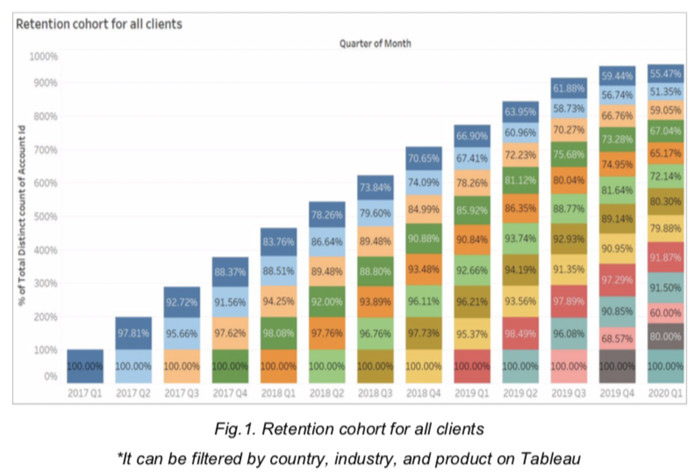
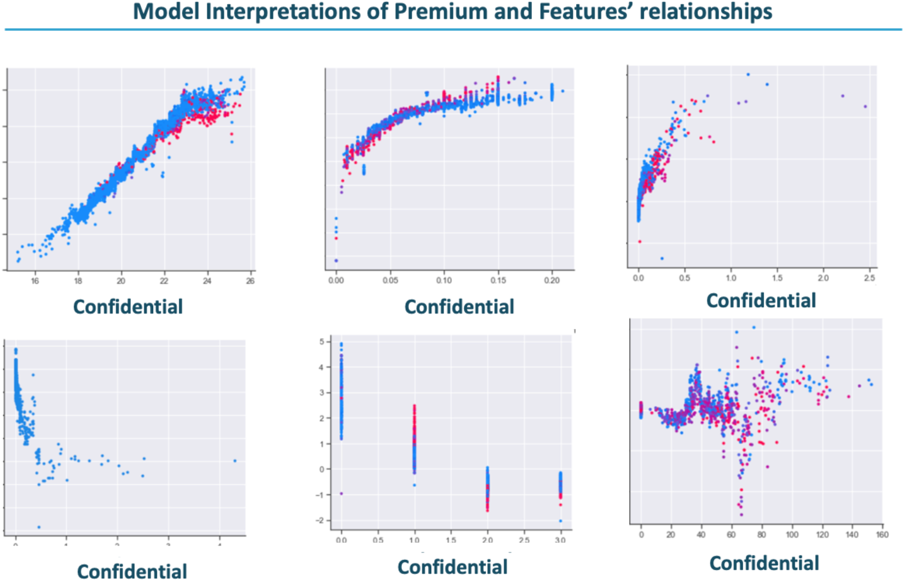

### 
 Hello👋, feel free to reach me out for any freelance Data Science project
I am a Data Scientist with strong curiocity, autonomy, creativity and leaning ability. What excites me the most is when I get to tackle difficult problems with no guidance, because that's where I can freely explore the creative solutions. I currently specialise in pricing optimisation.

### Visualization samples

 
